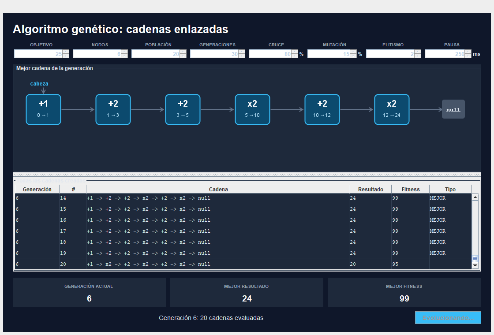
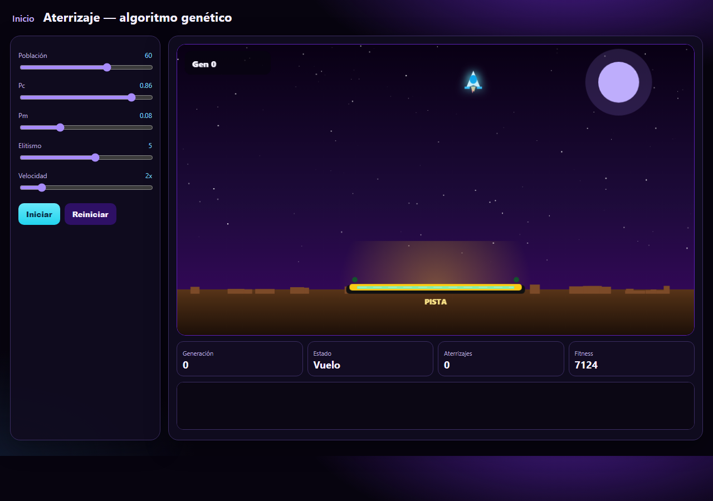

# Algoritmos genéticos

Proyecto académico compuesto por dos ejercicios que muestran cómo la
representación del cromosoma y la función de fitness cambian según el problema.

## Punto 1 — Cadenas con listas simplemente ligadas

Aplicación de escritorio desarrollada en Java y Swing. El algoritmo debe
encontrar una lista de operaciones `+1`, `+2` y `×2` que transforme cero en el
objetivo configurado.

Los cromosomas y la población se implementan con nodos y listas simplemente
ligadas propias, sin utilizar `ArrayList` para almacenar los individuos. La
interfaz permite cambiar:

- objetivo y longitud del cromosoma;
- tamaño de población y generaciones;
- probabilidades de cruce y mutación;
- cantidad de individuos conservados por elitismo;
- velocidad de visualización.

También conserva todas las cadenas evaluadas durante todas las generaciones.



[Explicación y estructura del código](tarea1/README.md)

### Ejecutar el punto 1

Se requiere JDK 8 o posterior. Desde `tarea1` en PowerShell:

```powershell
javac -d out (Get-ChildItem -Recurse -Filter *.java src).FullName
java -cp out app.Main
```

Para utilizar únicamente la consola:

```powershell
java -cp out app.Main --consola
```

## Punto 2 — Aterrizaje evolutivo

Aplicación web desarrollada con HTML, CSS y JavaScript. Cada individuo contiene
una secuencia de acciones de giro y propulsión. El fitness considera la cercanía
a la pista, las velocidades horizontal y vertical, la inclinación y el éxito del
aterrizaje.

La interfaz permite experimentar con población, cruce, mutación, elitismo y
velocidad de simulación.



### Ejecutar el punto 2

Abre [`tarea2/index.html`](tarea2/index.html) en un navegador o inicia un
servidor local desde la raíz:

```powershell
python -m http.server 8000
```

Después visita `http://localhost:8000/tarea2/`.

## Documentación

- [Documento final en PDF](Documentacion_AlgoritmosGeneticos.pdf)
- [Documento editable en Word](Documentacion_AlgoritmosGeneticos.docx)
- [Generador de documentación](documentacion/generar_documentacion.py)
- [Notebook](Algoritmos_Geneticos.ipynb)

La documentación sigue la estructura solicitada para los dos puntos:
descripción general, trabajos relacionados, función objetivo, población,
cruce y mutación, aplicaciones construidas, conclusiones y bibliografía.

## Estructura principal

```text
.
├── tarea1/
│   ├── README.md
│   └── src/
│       ├── app/
│       ├── estructuras/
│       ├── genetico/
│       ├── modelo/
│       └── vista/
├── tarea2/
│   ├── index.html
│   ├── script.js
│   └── styles.css
├── documentacion/
├── Documentacion_AlgoritmosGeneticos.pdf
└── Documentacion_AlgoritmosGeneticos.docx
```
